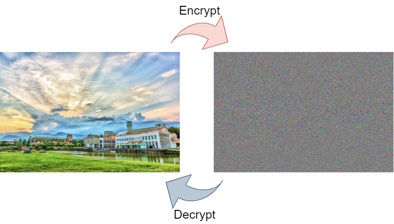

# Image Encryption Based on AES



_Image Encryption written in C++_

---

## Starting the code

Encryption can either be done using command or compiler

### Run the code using command

Image Encryption using the following command line argument --

```shell
Encryptgraph.exe <replace with your bmp file path>   <replace with your key>
```

For example, you can use the demo image provided with this code as --

```shell
.\Encryptgraph.exe .\pic\ndhu.bmp 123
```
Image Decryption using the following command line argument --

```shell
.\Decryptgraph.exe <replace with your bmp encryption file path>  <replace with your key>
```

For example, you can use the demo encryption image provided with this code as --

```shell
.\Decryptgraph.exe .\result\ndhu_pw_123.bmp 123
```

__NOTE__ -- If you want to modify Sbox in AES, edit the file `AES.cpp` instead of `Encryptgraph.cpp`. 

## Results
Encryption Image                                    After Decryption
        

Encryption Image                                    After Decryption

